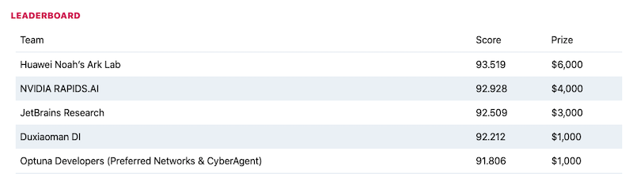

# Optuna Developers' Solution for Black-Box Optimization Challenge

First of all, we would like to thank BBO Challenge Organizers for this interesting competition. And congratulations to all winners.
Here is the code of Optuna Developers' solution for [NeurIPS 2020 Black-Box Optimization Challenge](https://bbochallenge.com/).

## Final Submissions

### Results

Our solution achieved 96.939 for public and also 91.806 for private.
We ranked 9th place in public and 5th place in private.



### Solution Overview

Our solution is based on TuRBO, a batch Bayesian optimization algorithm which restricts the search space to certain trust regions.
We made following improvements:

1. **Selection from multiple kernels**: Matern kernels (with `nu=[0.5, 1.5, 2.5]`) and RBF kernel.
2. **Stagnation Driven Trust Region Restart Strategy**: The trust region update is restarted when all the solutions in the same batch have the same evaluation value.
3. **Masking Length for the Trust Region**: Avoid to shrink the trust region for categorical and logit variables up to 10 iterations.
4. **Exhaustive Search**: We do an exhaustive search if the cardinality of the search space is smaller than or equal to the evaluation budge.
5. **Initialization with Sobol Sequences**: we employ Sobol sequences instead of Latin hypercube sampling, which is used by the original TuRBO.


### How to build the final submission

The final code is placed to `./submissions/mksturbo`.
You can prepare the submission using the `prepare_upload.sh` script.

```
$ ./prepare_upload.sh ./submissions/mksturbo/
```


### How to run local benchmarks using Bayesmark

You can run local benchamarks on publicly available problems using [Bayesmark](https://github.com/uber/bayesmark) library.
These problems using scikit-learn's classifiers/regressors and its built-in datasets.
See the [Bayesmark documentation](https://bayesmark.readthedocs.io/en/latest/index.html) for the details.

```
$ python3 -m venv venv  # Please use Python 3.6.10.
$ source venv/bin/activate
$ pip install -r environment.txt -r submissions/mksturbo/requirements.txt
$ ./run_local.sh ./submissions/mksturbo/ 3
```

<details>

<summary>Faster local benchmarking</summary>

You can also use [run_benchmark.py](./run_benchmark.py) to run local benchmarks.
This script is faster than `run_local.sh` because it runs benchmarks in parallel.

```
$ python run_benchmark.py --task large --repeat 3 --parallelism 16 --out ./output/ --optimizer ./submissions/mksturbo/
```

</details>


## Team Members

* Masashi Shibata (GitHub: [@c-bata](https://github.com/c-bata))
* Toshihiko Yanase (GitHub: [@toshihikoyanase](https://github.com/toshihikoyanase))
* Hideaki Imamura (GitHub: [@HideakiImamura](https://github.com/HideakiImamura))
* Masahiro Nomura (GitHub: [@nmasahiro](https://github.com/nmasahiro))
* Takeru Ohta (GitHub: [@sile](https://github.com/sile))
* Shotaro Sano (GitHub: [@g-votte](https://github.com/g-votte/))
* Hiroyuki Vincent Yamazaki (GitHub: [@hvy](https://github.com/hvy/))


## LICENSE

Our implementation is released under [Apache License 2.0](./LICENSE) license except for the code derived from TuRBO.